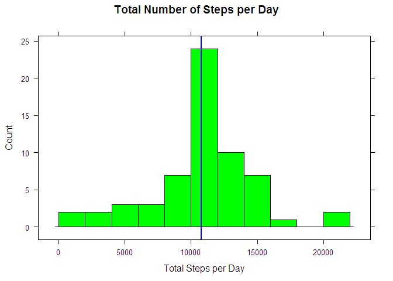
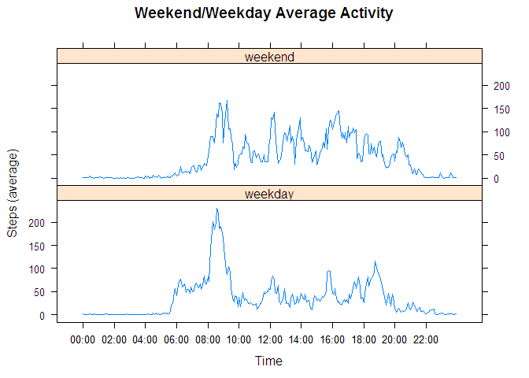

# Reproducible Research: Peer Assessment 1


## Loading and preprocessing the data

First let us unzip the data set and load it into a data frame.


```r
library(dplyr)
library(lattice)
activity <- read.csv(unz("activity.zip", "activity.csv"))
str(activity)
```

```
## 'data.frame':	17568 obs. of  3 variables:
##  $ steps   : int  NA NA NA NA NA NA NA NA NA NA ...
##  $ date    : Factor w/ 61 levels "2012-10-01","2012-10-02",..: 1 1 1 1 1 1 1 1 1 1 ...
##  $ interval: int  0 5 10 15 20 25 30 35 40 45 ...
```

It can be seen that the data set needs some tidying: the `steps` variable contains `NA`'s. As far as imputing missing values constitutes a distinct part of the assignment, we will perform this later on. Combining the `date` and `interval` into a single datetime variable does not seem reasonable as well.

## What is mean total number of steps taken per day?

To calculate the total number of steps per day, we group the `steps` variable by different `date` values and plot them as a histogram. We then mark the mean and the median
of the distribution with two vertical lines. The `NA` values are ignored here.


```r
tspd <- activity %>%
      group_by(date) %>%
      summarise(sum_steps = sum(steps))
histogram(tspd$sum_steps, breaks=10, col="green", 
     main="Total Number of Steps per Day", 
     xlab = "Total Steps per Day", type = "count",
     panel = function(x, y, ...) {
        panel.histogram(x, ...)   
        panel.abline(v = mean(tspd$sum_steps, na.rm=TRUE), col="red", lwd=2) 
        panel.abline(v = median(tspd$sum_steps, na.rm=TRUE), col="blue", lwd=2)
     })
```

 

Actually, these two lines result in a single one, because the distribution is centered: the mean is 10766.19 and the median is 10765.

## What is the average daily activity pattern?

To plot the average activity pattern, we now group the `steps` variable by different `interval` values. In order to provide even spacing along the x axis and proper labelling, we will add an id of each measurement of the day (there are `24 * 12 = 288` measurements per day) and a variable with the time value stringified. Then we find the maximum of daily activity.


```r
sp <- group_by(activity, interval)
sp <- summarize(sp, ave_steps = mean(steps, na.rm=TRUE))
sp$time <- formatC(sp$interval, flag = "0", big.mark = ":", big.interval = 2, width = 4)
sp$ticks <- sp$interval%/%100 * 60 + sp$interval%%100
xyplot(ave_steps ~ ticks, data = sp,
     type='l', 
     main = "Average Daily Activity", 
     xlab="Interval", ylab="Steps (mean)",
     scales = list(x = list(
           at = sp$ticks[sp$ticks%%120==0], labels=sp$time[sp$ticks%%120==0])),
     panel = function(x, y, ...) {
           panel.xyplot(x, y, ...)
           panel.abline(v = sp[which(sp$ave_steps == max(sp$ave_steps)),]$ticks, col="red", lwd=2)
     })
```

 

The exact maximum is:

```r
sp[which(sp$ave_steps == max(sp$ave_steps)),-4]
```

```
## Source: local data frame [1 x 3]
## 
##   interval ave_steps  time
## 1      835  206.1698 08:35
```

## Imputing missing values

Now we will deal with `NA`'s. First let's calculate how many values are missing:

```r
sum(is.na(activity$steps))
```

```
## [1] 2304
```
Now we will replace `NA`'s with the mean for a particular interval.


```r
imputed <- activity %>%
      group_by(interval) %>%
      mutate(mean_steps = mean(steps, na.rm=TRUE))
nas <- is.na(imputed$steps)
imputed$steps[nas] <-
      imputed$mean_steps[nas]
imputed$mean_steps <- NULL
```

Now we draw a histogram of total steps per day once more and mark mean and median once more.


```r
tspdi <- group_by(imputed, date) %>%
      summarise(sum_steps = sum(steps))
histogram(tspdi$sum_steps, breaks=10, col="green", 
     main="Total Number of Steps per Day", 
     xlab = "Total Steps per Day", type = "count",
     panel = function(x, y, ...) {
        panel.histogram(x, ...)   
        panel.abline(v = mean(tspdi$sum_steps), col="red", lwd=2) 
        panel.abline(v = median(tspdi$sum_steps), col="blue", lwd=2)
     })
```

 

Comparing the figure with the first one, we see that the central bar is higher while the rest is the same as before. This is consistent with what we've done: the number of measurements is now larger (because we count all the measurements we ignored earlier) and each of this measurements adds up to the frequency of the mean value. The mean is still 10766.19 and the median has slightly increased and become equal to the mean: 10766.19.


## Are there differences in activity patterns between weekdays and weekends?

Now we use the new data set with imputed values and create a factor variable `dayofweek` grouping measurements made on weekdays and on weekends.


```r
locale <- Sys.getlocale("LC_TIME")
Sys.setlocale("LC_TIME", "C")
imputed$dayofweek <- as.Date(imputed$date)
imputed$dayofweek <- weekdays(imputed$dayofweek, abbr=TRUE)
imputed$dayofweek <- factor(
      ifelse(imputed$dayofweek %in% c('Sat','Sun'),
             'weekend','weekday'))
Sys.setlocale("LC_TIME", locale)
```

We want to compare average daily activity for weekdays and weekends. To do this, we group our data by `interval` and the `dayofweek` variable and draw a two-panel plot.


```r
wvw <- imputed %>%
      group_by(interval, dayofweek) %>%
      summarize(ave_steps = mean(steps))
wvw$time <- formatC(wvw$interval, flag = "0", big.mark = ":", big.interval = 2, width = 4)
wvw$ticks <- wvw$interval%/%100 * 60 + wvw$interval%%100
xyplot(ave_steps ~ ticks | dayofweek, data = wvw, type = 'l',
       xlab = "Time", ylab = "Steps (average)",
       main = "Weekend/Weekday Average Activity", layout = c(1,2), scales = list(
             x=list(at=wvw$ticks[wvw$ticks%%120==0], labels=wvw$time[wvw$ticks%%120==0])))
```

 

The two figures show that the patterns are different: while weekdays have a distinctive peak in the morning and relatively little activity during the rest of the day, activity is spread more evenly on weekends.
